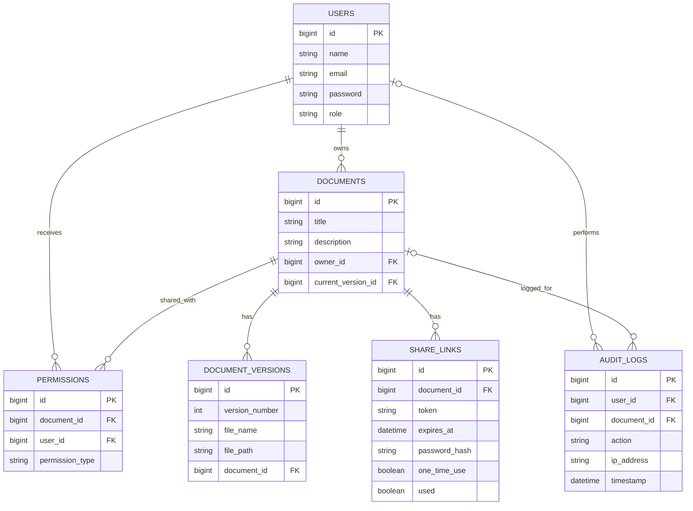

# 🔐 DocuVault — Secure Document Management API

A Spring Boot REST API to store documents securely. Files are encrypted with **AES-256-GCM**, access is protected with **JWT** and **per-document permissions**, and every document keeps a **version history**.

**Live API docs:** https://docuvault-q8o1.onrender.com/swagger-ui.html
*(Render free plan: the first request may take 30–60 seconds, and uploaded files are lost when the server restarts.)*

---

## Features

- User registration and login (BCrypt password hashing)
- JWT access token (15 min) and refresh token (7 days)
- Document create / read / update / delete with ownership
- File upload and download with AES-256-GCM encryption
- Version history and version restore
- Permissions: `VIEWER` and `EDITOR`
- Share links with optional expiry, password and one-time use
- Audit logging of document actions
- Search by title
- Swagger UI

## Tech Stack

Java 21 · Spring Boot · Spring Security · Spring Data JPA · PostgreSQL · JWT (JJWT) · BCrypt · AES-256-GCM · Swagger (springdoc) · Maven · Docker · Render

---

## ER Diagram



- A document has one owner and many versions; `current_version_id` points to the latest version.
- `PERMISSIONS` links a document with another user (`VIEWER` or `EDITOR`).
- Audit logs keep their history even after a document is deleted.

---

## How It Works

- **Upload:** file → permission check → AES-256-GCM encryption → saved in `uploads/` → new version record in the database.
- **Download:** permission check → read encrypted file → decrypt → returned with its original name.
- **Versions:** every upload creates a new version. Restoring an old version creates a *new* version from it, so history is never lost.
- **Share links:** the owner creates a link (optionally with expiry, password, one-time use). `GET /api/share/{token}` is public and validates the link: `404` not found, `401` wrong password, `410` expired or already used.

---

## API Endpoints

Auth column: **Public** = no token needed, **JWT** = `Authorization: Bearer <accessToken>`.

| Method | Endpoint | Auth | Purpose |
|---|---|---|---|
| POST | `/api/auth/register` | Public | Register (`name`, `email`, `password`) |
| POST | `/api/auth/login` | Public | Login, returns access + refresh token |
| POST | `/api/auth/refresh` | Public | New access token from `refreshToken` |
| POST | `/api/documents` | JWT | Create a document |
| GET | `/api/documents` | JWT | List my documents (owned + shared) |
| GET | `/api/documents/search?title=` | JWT | Search accessible documents by title |
| PUT | `/api/documents/{id}` | JWT | Update a document |
| DELETE | `/api/documents/{id}` | JWT | Delete a document (owner) |
| POST | `/api/documents/{id}/upload` | JWT | Upload a file (form-data field `file`) |
| GET | `/api/documents/{id}/download` | JWT | Download the current version |
| GET | `/api/documents/{id}/versions` | JWT | Version history (owner) |
| GET | `/api/documents/{documentId}/versions/{versionId}/download` | JWT | Download a specific version |
| POST | `/api/documents/{documentId}/versions/{versionId}/restore` | JWT | Restore a version (owner) |
| POST | `/api/documents/{documentId}/permissions` | JWT | Give a user `VIEWER` / `EDITOR` access (owner) |
| POST | `/api/share/{documentId}` | JWT | Create a share link (owner) |
| GET | `/api/share/{token}?password=` | Public | Validate a share link |

## Who Can Do What

| Action | Owner | EDITOR | VIEWER |
|---|:---:|:---:|:---:|
| Update document | ✅ | ✅ | ❌ |
| Upload file | ✅ | ✅ | ❌ |
| Download current / specific version | ✅ | ✅ | ✅ |
| View version history | ✅ | ❌ | ❌ |
| Restore version | ✅ | ❌ | ❌ |
| Delete document | ✅ | ❌ | ❌ |
| Give permissions / create share link | ✅ | ❌ | ❌ |

---

## Run Locally

**Needs:** Java 21 and PostgreSQL.

1. Create a database named `docuvault`.
2. Set the environment variables (below).
3. Run:

```bash
./mvnw spring-boot:run        # Windows: .\mvnw.cmd spring-boot:run
```

4. Open http://localhost:8080/swagger-ui.html

### Environment Variables

Secrets are never stored in the code; they are read from the environment.

| Variable | Required | Description |
|---|---|---|
| `DB_URL` | No | Default: `jdbc:postgresql://localhost:5432/docuvault` |
| `DB_USERNAME` | Yes | Database username |
| `DB_PASSWORD` | Yes | Database password |
| `JWT_SECRET` | Yes | Long random string (at least 32 characters) |
| `DOCUVAULT_ENCRYPTION_KEY` | Yes | Base64-encoded 32-byte AES key |

```bash
openssl rand -base64 32    # generate a key
```

> Keep the encryption key safe. If it changes, old files can no longer be decrypted.

## Swagger

Open `/swagger-ui.html`. Register, log in, copy the `accessToken`, click **Authorize**, paste the token, and use **Try it out**.

## Docker

```bash
docker build -t docuvault .

docker run -d --name docuvault -p 8080:8080 \
  -e DB_URL="jdbc:postgresql://host.docker.internal:5432/docuvault" \
  -e DB_USERNAME="<db-username>" \
  -e DB_PASSWORD="<db-password>" \
  -e JWT_SECRET="<random-secret>" \
  -e DOCUVAULT_ENCRYPTION_KEY="<base64-32-byte-key>" \
  docuvault
```

(On Windows PowerShell, write the `docker run` command on one line.)

## Deployment

Deployed on **Render** as a Docker Web Service with a Render PostgreSQL database. The environment variables above are set in the Render dashboard. On the free plan the disk is temporary, so uploaded files are lost on restart (database records stay).

---

## Security Summary

- Passwords and share-link passwords are hashed with BCrypt
- Stateless JWT authentication
- Files are encrypted at rest with AES-256-GCM (random IV per file)
- Owner / permission checks on every document action
- Secrets come from environment variables, not from the repository

## Future Improvements

- Download the document directly through a share link
- Persistent file storage (e.g. cloud storage)
- Endpoint to view audit logs
- Automated tests

## Author

**Swastika**, B.Tech IT, KNIT Sultanpur

- GitHub: [swastika-gupta26](https://github.com/swastika-gupta26)
- LinkedIn: [Swastika Gupta](https://www.linkedin.com/in/swastika-gupta-4ba45932b/)